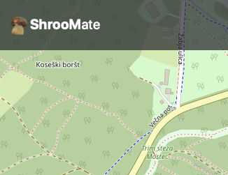
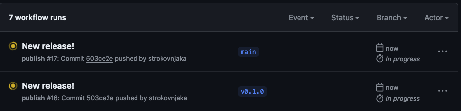
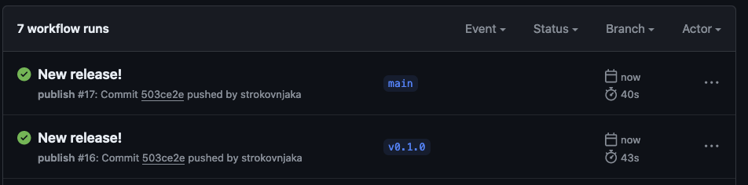
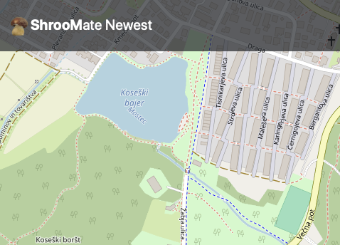
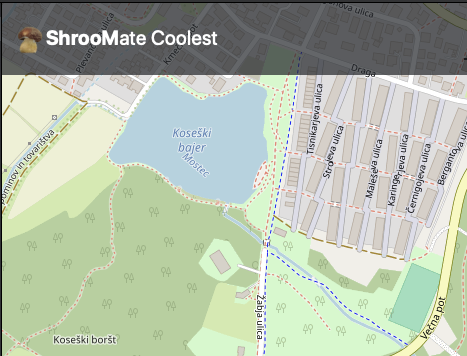

# Excercises in style: the power of shrooms in κυβερνήτης

## Prerequisites

Follow the [all-convering recipes](https://essa-23.training.garaza.io/kubernetes/prepare-environment/).

## Setup

- create shroom secrets

```
jkrivic@essa-vm-07 (⎈|microk8s:default):~/devopk8s$ k apply -f shroomate-sec.yaml 
secret/shroomate created
jkrivic@essa-vm-07 (⎈|microk8s:default):~/devopk8s$ k get secrets 
NAME        TYPE     DATA   AGE
shroomate   Opaque   3      11s
```

- create persistant volume claim to store DB

```
jkrivic@essa-vm-07 (⎈|microk8s:default):~/devopk8s$ k apply -f mongo-pvc.yaml
persistentvolumeclaim/mongo created

```

- create mongo stateful set and service

```
jkrivic@essa-vm-07 (⎈|microk8s:default):~/devopk8s$ k apply -f mongo-sts.yaml -f mongo-svc.yaml
statefulset.apps/mongo created
service/mongo created
jkrivic@essa-vm-07 (⎈|microk8s:default):~/devopk8s$ k get service
NAME         TYPE        CLUSTER-IP     EXTERNAL-IP   PORT(S)     AGE
kubernetes   ClusterIP   10.152.183.1   <none>        443/TCP     5d3h
mongo        ClusterIP   None           <none>        27017/TCP   46s
```

- see mongo pod being run

```
jkrivic@essa-vm-07 (⎈|microk8s:default):~/devopk8s$ k get pods --watch
NAME      READY   STATUS    RESTARTS   AGE
mongo-0   0/1     Pending   0          5s
mongo-0   0/1     Pending   0          11s
mongo-0   0/1     ContainerCreating   0          11s
mongo-0   0/1     ContainerCreating   0          12s
mongo-0   1/1     Running             0          24s
```

- create app deployment and service

```
jkrivic@essa-vm-07 (⎈|microk8s:default):~/devopk8s$ k apply -f app-dep.yaml -f app-svc.yaml
```

- create cluster issuer for letsencrypt 

```
jkrivic@essa-vm-07 (⎈|microk8s:default):~/devopk8s$ k apply -f letsencrypt-cli.yaml 
clusterissuer.cert-manager.io/letsencrypt created
jkrivic@essa-vm-07 (⎈|microk8s:default):~/devopk8s$ k get secrets 
NAME                    TYPE                DATA   AGE
shroomate               Opaque              3      5m4s
shroomate-ingress-tls   kubernetes.io/tls   2      11s
```

- create ingress for the app

```
jkrivic@essa-vm-07 (⎈|microk8s:default):~/devopk8s$ k apply -f shroomate-ing.yaml 
ingress.networking.k8s.io/shroomate created
jkrivic@essa-vm-07 (⎈|microk8s:default):~/devopk8s$ k get ingress
NAME        CLASS    HOSTS               ADDRESS     PORTS     AGE
shroomate   public   essa-vm-07.lrk.si   127.0.0.1   80, 443   14m
```

## Rolling updates

- make a new release (e.g. current v0.0.7, new v0.1.0) (commit, push, and tag in git)

- check we are serving the old v0.0.7 version (nav. title saying just "ShrooMate")



- github actions automagically build a new docker image v0.1.0 by themselves
  




- change container image release in `app-dep.yaml`

```
...
    containers:
      image: ghcr.io/strokovnjaka/shroomate:0.1.0
...
```

- apply deployment

```
jkrivic@essa-vm-07 (⎈|microk8s:default):~/devopk8s$ k apply -f app-dep.yaml
deployment.apps/app configured
```

- observe pods being created and terminated according to strategy (`maxSurge 1, maxUnavailabe: 0`)

```
jkrivic@essa-vm-07 (⎈|microk8s:default):~/devopk8s$ k get pod --watch
NAME                   READY   STATUS    RESTARTS   AGE
mongo-0                1/1     Running   0          16m
app-6747f77fc9-77m2v   1/1     Running   0          16m
app-6747f77fc9-sbhnf   1/1     Running   0          16m
app-6747f77fc9-5k7xq   1/1     Running   0          16m
app-8448456fdf-4r82m   0/1     Pending   0          0s
app-8448456fdf-4r82m   0/1     Pending   0          0s
app-8448456fdf-4r82m   0/1     ContainerCreating   0          0s
app-8448456fdf-4r82m   0/1     ContainerCreating   0          0s
app-8448456fdf-4r82m   0/1     Running             0          27s
app-8448456fdf-4r82m   0/1     Running             0          33s
app-8448456fdf-4r82m   1/1     Running             0          34s
app-6747f77fc9-5k7xq   1/1     Terminating         0          23m
app-8448456fdf-zkz9g   0/1     Pending             0          0s
app-8448456fdf-zkz9g   0/1     Pending             0          0s
app-8448456fdf-zkz9g   0/1     ContainerCreating   0          0s
app-6747f77fc9-5k7xq   1/1     Terminating         0          23m
app-8448456fdf-zkz9g   0/1     ContainerCreating   0          1s
app-6747f77fc9-5k7xq   0/1     Terminating         0          23m
app-6747f77fc9-5k7xq   0/1     Terminating         0          23m
app-6747f77fc9-5k7xq   0/1     Terminating         0          23m
app-8448456fdf-zkz9g   0/1     Running             0          2s
app-8448456fdf-zkz9g   0/1     Running             0          12s
app-8448456fdf-zkz9g   1/1     Running             0          12s
app-6747f77fc9-77m2v   1/1     Terminating         0          23m
app-8448456fdf-lwxsk   0/1     Pending             0          0s
app-8448456fdf-lwxsk   0/1     Pending             0          0s
app-8448456fdf-lwxsk   0/1     ContainerCreating   0          0s
app-6747f77fc9-77m2v   1/1     Terminating         0          23m
app-8448456fdf-lwxsk   0/1     ContainerCreating   0          1s
app-6747f77fc9-77m2v   0/1     Terminating         0          23m
app-6747f77fc9-77m2v   0/1     Terminating         0          23m
app-6747f77fc9-77m2v   0/1     Terminating         0          23m
app-8448456fdf-lwxsk   0/1     Running             0          2s
app-8448456fdf-lwxsk   0/1     Running             0          12s
app-8448456fdf-lwxsk   1/1     Running             0          12s
app-6747f77fc9-sbhnf   1/1     Terminating         0          23m
app-6747f77fc9-sbhnf   1/1     Terminating         0          23m
app-6747f77fc9-sbhnf   0/1     Terminating         0          23m
app-6747f77fc9-sbhnf   0/1     Terminating         0          23m
app-6747f77fc9-sbhnf   0/1     Terminating         0          23m

jkrivic@essa-vm-07 (⎈|microk8s:default):~/devopk8s$ k get pods
NAME                       READY   STATUS    RESTARTS   AGE
pod/mongo-0                1/1     Running   0          33m
pod/app-8448456fdf-4r82m   1/1     Running   0          9m46s
pod/app-8448456fdf-zkz9g   1/1     Running   0          9m12s
pod/app-8448456fdf-lwxsk   1/1     Running   0          9m
```

- check we are serving the newly deployed version (nav. title saying "ShrooMate Newest")




## Blue-green deployment

- make a copy of app deployment and service, change names, labels, and, of course, container image, e.g.

```
jkrivic@essa-vm-07 (⎈|microk8s:default):~/devopk8s$ cp app-dep.yaml app-dep-v2.yaml
jkrivic@essa-vm-07 (⎈|microk8s:default):~/devopk8s$ cp app-svc.yaml app-svc-v2.yaml 
jkrivic@essa-vm-07 (⎈|microk8s:default):~/devopk8s$ vi app-svc-v2.yaml
...
jkrivic@essa-vm-07 (⎈|microk8s:default):~/devopk8s$ vi app-dep-v2.yaml 
...
```

- create new deployment and service

```
jkrivic@essa-vm-07 (⎈|microk8s:default):~/devopk8s$ k get all
NAME                          READY   STATUS    RESTARTS   AGE
pod/mongo-0                   1/1     Running   0          51m
pod/app-8448456fdf-4r82m      1/1     Running   0          27m
pod/app-8448456fdf-zkz9g      1/1     Running   0          27m
pod/app-8448456fdf-lwxsk      1/1     Running   0          27m
pod/app-v2-7c966b8c94-lwnmh   1/1     Running   0          40s
pod/app-v2-7c966b8c94-t7sdn   1/1     Running   0          40s
pod/app-v2-7c966b8c94-br6xm   1/1     Running   0          40s

NAME                 TYPE        CLUSTER-IP       EXTERNAL-IP   PORT(S)     AGE
service/kubernetes   ClusterIP   10.152.183.1     <none>        443/TCP     6d5h
service/mongo        ClusterIP   None             <none>        27017/TCP   56m
service/app          ClusterIP   10.152.183.186   <none>        80/TCP      49m
service/app-v2       ClusterIP   10.152.183.131   <none>        80/TCP      40s

NAME                     READY   UP-TO-DATE   AVAILABLE   AGE
deployment.apps/app      3/3     3            3           50m
deployment.apps/app-v2   3/3     3            3           40s

NAME                                DESIRED   CURRENT   READY   AGE
replicaset.apps/app-8448456fdf      3         3         3       27m
replicaset.apps/app-6747f77fc9      0         0         0       50m
replicaset.apps/app-v2-7c966b8c94   3         3         3       40s

NAME                     READY   AGE
statefulset.apps/mongo   1/1     51m
```

- test new service works

```
jkrivic@essa-vm-07 (⎈|microk8s:default):~/devopk8s$ curl 10.152.183.131
<!doctype html>
<html lang="en" data-critters-container>
...
```

- switch to the new service by flipping ingress to `app-svc-v2`

```
jkrivic@essa-vm-07 (⎈|microk8s:default):~/devopk8s$ cp shroomate-ing.yaml shroomate-ing-v2.yaml 
jkrivic@essa-vm-07 (⎈|microk8s:default):~/devopk8s$ vi shroomate-ing-v2.yaml
...

 - host: essa-vm-07.lrk.si
   http:
     paths:
     - path: /
       pathType: Prefix
       backend:
         service:
           name: app-v2  # <--- here
           port:
             number: 80
... 
jkrivic@essa-vm-07 (⎈|microk8s:default):~/devopk8s$ k apply -f shroomate-ing.yaml 
ingress.networking.k8s.io/shroomate configured
```

- check we are serving the newly deployed version (nav. title saying "ShrooMate Coolest")




## Notes

### Probes

Mongo stateful set has
- startup probe, which checks that TCP socket can be opened to mongo's port
- liveness probe, which does the same
- readiness probe, which checks if mongodb server can be pinged via `mongosh`
  
Shroomate app deployment startup and liveness probes are almost the same (using the app's port), while
readiness probe checks if a page that accesses the db also works.

